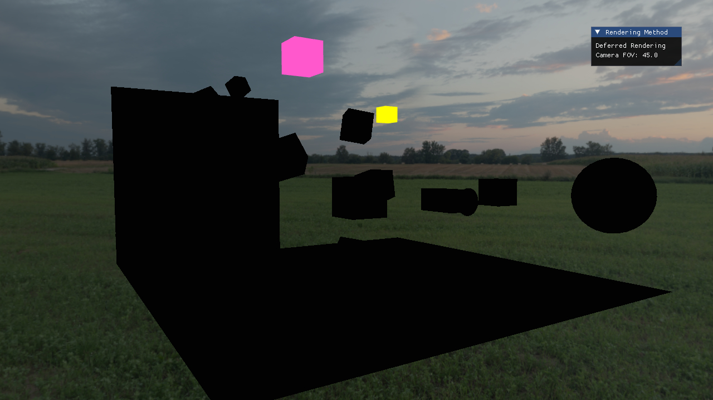
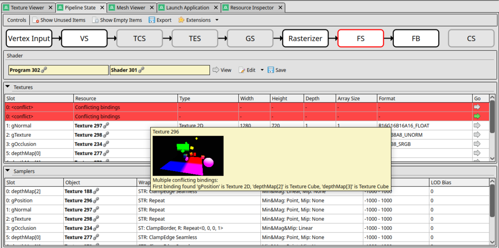
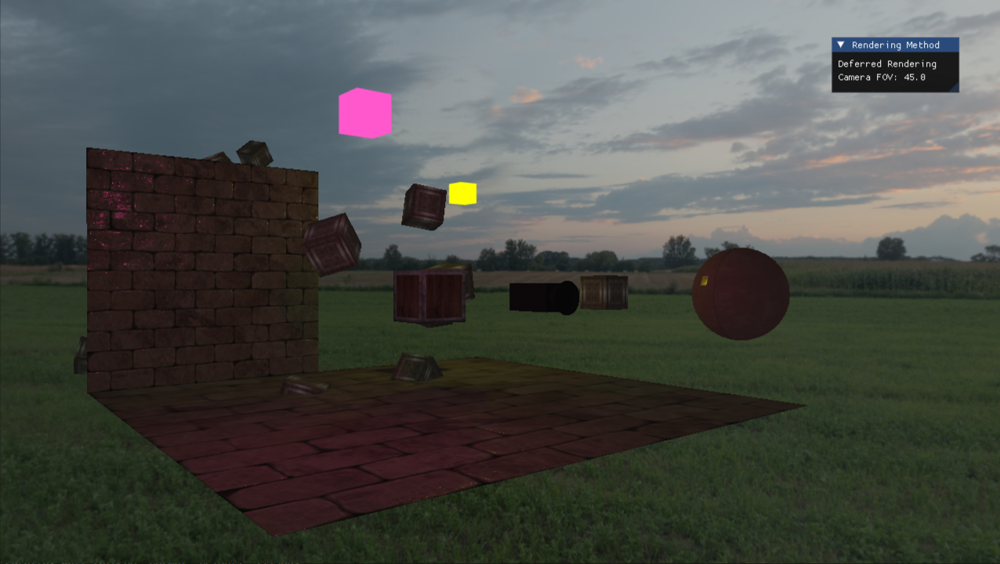

# Deferred Rendering / Shadow Mapping Bug Investigation

## Symptoms



Objects rendered through the GBuffer became completely black when:

```text
gPosition  = 0
gNormal    = 1
gTexture   = 2
gOcclusion = 3
```

and point shadows were enabled.

Surprisingly, shifting the GBuffer bindings by one:

```text
gPosition  = 1
gNormal    = 2
gTexture   = 3
gOcclusion = 4
```

made the problem disappear.

Disabling shadows also fixed the issue.

This initially suggested a texture binding order issue, but the root cause was elsewhere.

---

## Investigation

Several possibilities were explored:

* Incorrect shadow cubemap bindings
* Wrong texture unit assignments
* NaN propagation from shadow calculations
* Corrupted depth maps
* Sampler array indexing bugs
* OpenGL state leakage

RenderDoc was eventually used to inspect the deferred lighting pass.

---

## Discovery

RenderDoc reported:

```text
<conflict>
```

on texture unit 0.

The fragment shader contained:

```glsl
uniform samplerCube depthMap[MAX_LIGHTS];
```

with:

```cpp
MAX_LIGHTS = 4;
```

Only active shadow maps were assigned texture units:

```cpp
depthMap[0]
depthMap[1]
```

while:

```cpp
depthMap[2]
depthMap[3]
```

were never assigned.



OpenGL therefore left them at the default texture unit:

```text
0
```

The same texture unit was already being used by:

```glsl
uniform sampler2D gPosition;
```

resulting in:

```text
Texture Unit 0
├── sampler2D   (gPosition)
└── samplerCube (depthMap[2])
```

which is undefined behavior.

---

## Why It Was Misleading

The shader never intentionally sampled:

```cpp
depthMap[2]
depthMap[3]
```

because only active lights were processed.

However, the presence of conflicting sampler bindings was enough to trigger undefined behavior inside the driver.

Moving the GBuffer away from texture unit 0 merely hid the conflict.

---

## Fix

Assign every sampler in the shadow map array, regardless of active light count:

```cpp
for (uint8_t i = 0; i < MAX_LIGHTS; i++) {

    if (i < light_count) componentManager.pointShadowFrames[i].frame->bindTexture(lastTextureUnit);
    shader->setInt(("depthMap[" + std::to_string(i) + "]").c_str(), lastTextureUnit++);
}
```

Active shadow maps are then bound to the corresponding texture units.

This guarantees that no sampler remains bound to texture unit 0 by default.



---

## Lessons Learned

* Unused sampler array elements can still create binding conflicts.
* Texture unit conflicts can produce completely misleading symptoms.
* RenderDoc is invaluable for debugging graphics issues.
